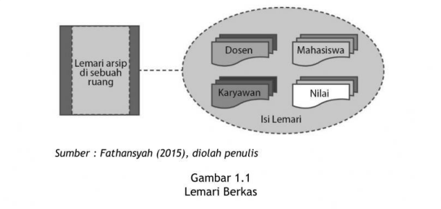
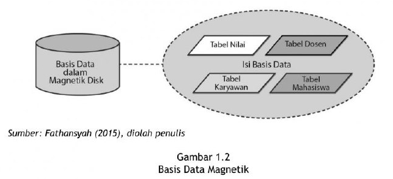
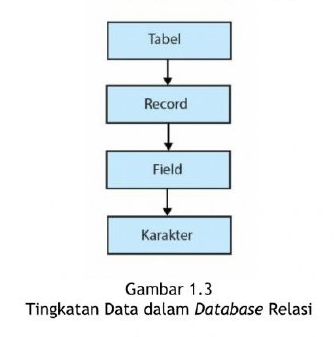

# Basis Data

## Daftar Isi

- [Basis Data](#basis-data)
  - [Daftar Isi](#daftar-isi)
  - [LATAR BELAKANG](#latar-belakang)
  - [PENGERTIAN BASIS DATA](#pengertian-basis-data)
  - [MANFAAT DAN TUJUAN BASIS DATA](#manfaat-dan-tujuan-basis-data)
  - [KELEBIHAN DAN KEKURANGAN BASIS DATA](#kelebihan-dan-kekurangan-basis-data)
    - [Kelebihan](#kelebihan)
    - [Kekurangan](#kekurangan)
  - [TINGKATAN DATA DALAM DATABASE RELASI](#tingkatan-data-dalam-database-relasi)
    - [Karakter (character)](#karakter-character)
    - [Field atau Attribute](#field-atau-attribute)
    - [Record atau Tupple](#record-atau-tupple)
    - [Table/Entity](#tableentity)
  - [OPERASI DASAR BASIS DATA](#operasi-dasar-basis-data)
    - [Pembuatan basis data baru (CREATE DATABASE)](#pembuatan-basis-data-baru-create-database)
    - [Penghapusan basis data (DROP DATABASE)](#penghapusan-basis-data-drop-database)
    - [Pembuatan tabel baru ke suatu basis data (CREATE TABLE)](#pembuatan-tabel-baru-ke-suatu-basis-data-create-table)
    - [Penghapusan tabel dan suatu basis data (DROP TABLE)](#penghapusan-tabel-dan-suatu-basis-data-drop-table)
    - [Penambahan atau pengisian data baru ke sebuah tabel di sebuah basis data (INSERT)](#penambahan-atau-pengisian-data-baru-ke-sebuah-tabel-di-sebuah-basis-data-insert)
    - [Pengambilan data dari sebuah tabel (SELECT)](#pengambilan-data-dari-sebuah-tabel-select)
    - [Perubahan atau manipulasi data dari sebuah tabel (UPDATE)](#perubahan-atau-manipulasi-data-dari-sebuah-tabel-update)
    - [Penghapusan data dan sebuah tabel (DELETE)](#penghapusan-data-dan-sebuah-tabel-delete)
  - [PENERAPAN BASIS DATA](#penerapan-basis-data)
  - [RANGKUMAN](#rangkuman)

## LATAR BELAKANG

Diperlukannya basis data dalam suatu perusahaan, pada dasarnya adalah untuk kemudahan dan kecepatan dalam pengambilan data. Untuk lebih jelasnya dapat dilihat pada Gambar 1.1 dan Gambar 1.2.





Dari gambar tersebut, terlihat perbedaan antara basis data dan lemari arsip di mana setiap rak dalam lemari tersebut dapat menyimpan dokumen-dokumen manual yang terdiri dari lembaran-lembaran kertas.

Masalah yang dihadapi pada lemari arsip adalah kelambatan dalam proses penelusuran data pada lemari arsip tersebut. Misalkan ingin mencari arsip untuk pegawai tertentu. Untuk menemukan hasilnya, akan membutuhkan waktu yang lama. Hal ini disebabkan proses pencarian harus mencari lembaran–lembaran yang ada pada dokumen tersebut dan dapat menyebabkan waktu pencarian yang kurang efisien.

Berikut adalah beberapa alasan mengapa sebuah organisasi atau perusahaan memerlukan sebuah basis data, diantaranya:

1. Membantu Pengelolaan Data yang Besar
   Basis data  dapat menyimpan dan membantu mengelola data dalam jumlah yang besar secara rinci dan terintegrasi. Hal ini sangat tidak mungkin jika menggunakan Perangkat lunak spreadsheet seperti Microsoft Excel atau Apache OpenOffice Calc karena kapasitas penyimpanan dan kecepatan mengolah data dalam Microsoft Excel dan Apache Open Office sangat terbatas.
2. Akurasi Data
   Sebuah basis data secara umum dapat menjamin akurasi data. Hal tersebut dikarenakan basis data memiliki fitur constraints dan default value check.  Constrains adalah aturan-aturan di dalam tabel basis data yang dapat mencegah penghapusan atau perubahan data dari suatu tabel karena data dalam tabel tersebut mempunyai keterkaitan dengan data pada tabel lain. Sedangkan default value check adalah proses cek jika data yang dimasukkan ke dalam basis data tidak mempunyai nilai (null) maka nilai default yang akan digunakan.
3. Mudah dalam Proses Manipulasi Data
   Sebuah perangkat lunak basis data, memiliki fitur yang dapat memudahkan dalam melakukan proses manipulasi data (proses insert/update/delete). Salah satunya dengan menggunakan Data Manipulation Languages (DML) yang termasuk ke dalam Structured Query Language (SQL).
4. Keamanan Data
   Perangkat lunak basis data memiliki fitur keamanan. Hal tersebut bertujuan untuk menjaga data dari hal-hal yang tidak diinginkan. Sebagai contoh misalnya sebelum pengguna mendapatkan data yang diinginkan, pengguna harus melakukan login terlebih dahulu, sehingga data lebih aman.
5. Integritas Data
   Sebuah basis data dapat menjamin integritas data. Karena basis data memiliki fitur constrains, maka integritas data dalam basis data dapat terjamin. Sebagai contoh jika terjadi perubahan data di dalam Tabel A, maka tabel yang memiliki keterkaitan dengan Tabel A akan mengikuti perubahan tersebut atau basis data akan mencegah perubahan pada Tabel A jika diatur demikian. Demikian juga untuk proses penambahan data maupun penghapusan data. Dengan adanya hal tersebut integritas data dapat terjamin.

## PENGERTIAN BASIS DATA

Berbicara tentang basis data dapat diartikan bahwa seluruh data yang disimpan dalam sebuah basis data ditempatkan pada masing-masing table/file sesuai dengan fungsinya. Dengan tersimpannya data dalam basis data tersebut, maka akan dengan mudah dapat melakukan penelusuran data yang diinginkan sehingga berdampak pada waktu pencarian yang lebih efisien.

Di dalam suatu media penyimpanan (misalnya harddisk), dapat ditempatkan lebih dari 1(satu) basis data secara elektronik. Namun, tidak semua bentuk penyimpanan data yang disimpan secara elektronik dikatakan basis data karena ketika menyimpan dokumen di dalam sebuah harddisk, harddisk tersebut dapat berisi data file teks dari program pengolahan kata, spreadsheet, dan lainnya.

Yang ditekankan dalam basis data adalah pengaturan, pemilahan, pengelompokan, dan pengorganisasian data yang disimpan sesuai dengan fungsinya. Hal tersebut bisa berbentuk sejumlah file, table terpisah, atau dalam bentuk pendefinisian kolom (field) data dalam setiap file atau table tersebut.

**Pengertian Basis Data** Basis Data berasal dari kata Basis dan Data. Adapun pengertian dari kedua kata tersebut adalah sebagai berikut:

1. Basis dapat diartikan sebagai markas atau gudang atau tempat bersarang atau tempat berkumpul.
2. Data dapat diartikan sebagai representasi fakta dunia nyata yang mewakili suatu objek seperti manusia (pegawai, siswa, pembeli, dan pelanggan), barang, hewan, peristiwa, konsep, keadaan, dan sebagainya. Objek tersebut direkam dalam bentuk angka, huruf, simbol, teks, gambar, bunyi, atau kombinasinya.

Basis Data sebagai satu kesatuan dapat didefinisikan sebagai berikut.

1. Himpunan kelompok data yang saling berhubungan dan terorganisasi dengan baik agar kelak dapat dimanfaatkan kembali dengan cepat dan mudah.
2. Kumpulan data yang saling berhubungan dan disimpan dengan baik secara bersama-sama tanpa pengulangan (redudansi) yang tidak diperlukan.
3. Kumpulan file, tabel, atau arsip yang saling berhubungan dan disimpan dalam satu media penyimpanan elektronik. Kumpulan  file ini selanjutnya disebut Tabel (Table) sebagai komponen utama untuk membangun basis data. (Fathahansyah, 2015)

Dalam beberapa literatur, basis data telah didefinisikan dengan cara yang berbeda. Salah satu definisi yang cukup lengkap dan baik tentang istilah basis data adalah yang diberikan oleh James Martin (1975) dalam buku Sistem Basis Data (Edhy Sutanta, 2004, h. 17) sebagai berikut:

*“A database may be defined as a collection of interrelated data stored together without harmful or unnecessary redundancy to serve one or more application in an optimal fashion; the data are stored so that they are independent of programs its used the data; a common and controlled approach its used in adding new data and in modifying and retrieving exiting data whithin the database”.*

Basis Data dapat dipahami sebagai suatu kumpulan data terhubung yang disimpan secara bersama-sama pada suatu media. Walaupun disimpan secara bersama-sama dan saling terhubung, kumpulan data tersebut tersimpan tanpa saling tumpang tindih satu sama lain atau tidak terjadi kerangkapan data. Namun, jika pun terjadi kerangkapan data maka kerangkapan data tersebut harus terjadi seminimal mungkin dan dapat terkontrol. Beberapa kondisi data di dalam suatu basis data diantaranya:

1. data disimpan dengan cara-cara tertentu sehingga memudahkan ketika akan digunakan atau ditampilkan kembali.
2. data dapat digunakan oleh satu atau beberapa program aplikasi secara optimal.
3. data disimpan tanpa mengalami ketergantungan dengan program-program yang akan menggunakannya.
4. data disimpan sedemikian rupa sehingga proses penambahan, pengambilan, dan modifikasi data dapat dilakukan dengan mudah dan terkontrol.

Dari definisi tersebut dapat disimpulkan bahwa pengertian basis data adalah koleksi terpadu dari data yang saling berkaitan dan dirancang untuk memenuhi kebutuhan informasi suatu organisasi. Masing–masing table/file di dalam basis data tersebut berfungsi untuk menampung atau menyimpan data dimana data-data tersebut saling berhubungan dengan satu dengan yang lain.

Dari pengertian tersebut dapat dikatakan bahwa basis data memiliki beberapa kriteria penting antara lain:

1. beorientasi pada data.
2. data dapat digunakan oleh pemakai yang berbeda-beda atau beberapa program aplikasi tanpa perlu mengubah basis data.
3. data dalam basis data dapat berkembang dengan mudah baik volume maupun strukturnya.
4. data yang ada dapat memenuhi kebutuhan sistem-sistem baru secara mudah.
5. data dapat digunakan dengan cara yang berbeda-beda.
6. kerangkapan data minimal.

## MANFAAT DAN TUJUAN BASIS DATA

Manfaat basis data adalah untuk pengelolaan data dalam memudahkan atau menemukan kembali data yang dicari dengan cepat.

Tujuan Basis Data antara lain sebagai berikut:

1. Kecepatan dan kemudahan (*Speed*). Dengan basis data dapat menyimpan data atau melakukan perubahan, penghapusan, penambahan, dan pemanggilan kembali data yang tersimpam dengan cepat dan mudah.
2. Efisiensi ruang penyimpanan (*Space*). Dengan basis data penggunaan ruang penyimpanan data dapat dilakukan dengan melakukan meminimalisasi jumlah pengulangan data dan dengan menerapkan sejumlah pengkodean.
3. Keakuratan (*Accuracy*). Dengan memanfaatkan pengkodean atau pembentukan relasi antar data, penerapan aturan atau batasan tipe data dapat diterapkan dalam basis data yang berguna untuk menentukan keakuratan saat input data atau penyimpanan data.
4. Keamanan (*Security*). Sejumlah sistem (aplikasi) pengelolaan basis data tidak menerapkan aspek keamanan dalam penggunaannya. Akan tetapi, untuk sistem yang besar dan serius, aspek keamanan menjadi hal yang penting untuk diterapkan. Dengan begitu, sistem dapat menentukan siapa yang boleh menggunakan basis data dan menentukan jenis operasi-operasi apa saja yang boleh dilakukan.
5. Terpeliharanya keselarasan data (*Consistent*). Apabila ada perubahan data pada aplikasi yang berbeda, secara otomatis perubahan itu berlaku untuk keseluruhan.
6. Kebersamaan pemakaian (*Sharebility*). Data dapat dipakai secara bersama-sama oleh beberapa program aplikasi saat bersamaan.
7. Dapat diterapkan standarisasi (Standardization). Dengan adanya pengontrolan yang terpusat, basis data dapat menerapkan standarisasi data yang disimpan sehingga memudahkan pemakaian, distribusi, maupun pertukaran data.
8. Ketersediaan (*Availability*). Basis data dapat memilah data utama atau master, transaksi, data history hingga data kedaluwarsa. Data yang jarang atau tidak digunakan lagi dapat diatur untuk dipisahkan dari sistem basis data yang aktif.
9. Kelengkapan (*Completeness*). Kelengkapan sebuah data bersifat relatif, dalam sebuah basis data penilaian kelengkapan data sangat bergantung pada pengguna sehingga penilaian tidak selalu sama.

## KELEBIHAN DAN KEKURANGAN BASIS DATA

### Kelebihan

1. Dapat meningkatkan kemandirian data. Sebuah basis data dapat digunakan untuk bermacam-macam program aplikasi tanpa harus mengubah format data yang sudah ada.
2. Konsistensi data. Konsistensi data di dalam basis data dilakukan dengan cara data disimpan hanya sekali dalam basis data sehingga jika terjadi perubahan pada nilai data tersebut, perubahan hanya dilakukan satu kali dan nilai baru tersebut akan tersedia untuk semua pengguna.
3. Meningkatkan aksesibilitas terhadap data dan respon yang lebih baik. Dengan basis data maka aksesibilitas data dan respon akan lebih baik. Hal tersebut dapat dicapai dengan integrasi data yang melewati batasan-batasan departemen dalam organisasi sehingga data dapat langsung diakses oleh pengguna.
4. Pengendalian terhadap kerangkapan data. Data dalam sebuah basis data dilakukan penyimpanan dengan cara disimpan satu kali. Hal ini mengurangi kerangkapan data dan mengurangi biaya untuk tempat penyimpanan.
5. Meningkatkan keamanan data. Keamanan basis data dapat melindungi basis data dari pengguna yang tidak memiliki otorisasi. Basis data dapat menentukan batasan-batasan pengaksesan data, misalnya dengan memberikan password dan pemberian hak akses bagi pemakai (misalnya untuk hak akses dalam proses update, delete, insert, maupun select).
6. Memperbaiki integritas data. Intergritas data mengacu pada validitas dan konsistensi dari data yang disimpan. Integritas biasanya diekspresikan dalam batasan (constraints) yang merupakan aturan yang konsisten dan tidak dapat dilanggar. Jika kerangkapan data dapat dikontrol dan kekonsistenan data dapat dijaga, maka data menjadi akurat.
7. Data dapat dipakai secara bersama-sama. Data yang ada pada basis data menjadi milik seluruh organisasi dan dapat dipakai secara bersama oleh pengguna yang berwenang pada saat bersamaan.
8. Memperoleh lebih banyak informasi dari data yang sama. Pengguna basis data dapat memperoleh informasi selain dari informasi rutin yang dikelolanya karena semua data lain berada dalam basis data yang sama. Dengan demikian, kebutuhan akan informasi selain dari informasi rutin dapat terpenuhi.

### Kekurangan

1. Biayanya dapat menjadi sangat mahal karena menyangkut biaya-biaya untuk pembelian sekaligus perawatan hardware dan software. Selain itu, terdapat juga biaya tambahan untuk untuk penyimpanan (storage), jaringan (network), dan lain-lain.
2. Rumit. Perancang, pengembang, Data Base Administator (DBA), dan pengguna akhir harus memahami secara rinci dan mendalam tentang fungsi basis data yang ditangani agar dapat mengambil manfaat dari basis data. Kegagalan dalam memanfaatkannya dapat menyebabkan kerugian yang cukup besar bagi organisasi atau perusahaan.
3. Tambahan biaya konversi. Diperlukan biaya yang besar untuk berpindah dari aplikasi atau sistem yang lama ke dalam sistem basis data yang baru. Selain itu, diperlukan pula biaya untuk pelatihan staf dalam menggunakan sistem yang baru ini serta tambahan biaya untuk mempekerjakan staf khusus seperti DBA, dan lain-lain.

## TINGKATAN DATA DALAM DATABASE RELASI

Dalam suatu sistem database relasi, data yang tersimpan dalam DBMS mempunyai tingkatan-tingkatannya, sebagaimana tampak dalam Gambar 1.3 berikut.  



### Karakter (character)

Merupakan bagian terkecil dalam database, dapat berupa karakter numerik (angka 0 s.d 9), huruf (A – Z, a – z) ataupun karakter-karakter khusus, seperti *, &. %, # dan lain-lain.

### Field atau Attribute

Merupakan bagian dari record yang menunjukkan suatu item data yang sejenis, misalnya field nama, field NIM, dan lain sebagainya. Setiap field harus mempunyai nama dan tipe data tertentu. Isi dari field disebut Data Value. Dalam table dari sebuah database, field ini disebut juga kolom.

### Record atau Tupple

Tuple/Record adalah kumpulan data value dari attribute yang berkaitan sehingga dapat menjelaskan sebuah entity secara lengkap. Misal record entity mahasiswa adalah kumpulan data value dari field nomor telepon genggam, nama, jurusan, dan alamat per-barisnya. Dalam database, record disebut juga baris.

### Table/Entity

Entity merupakan sesuatu yang dapat diidentifikasi dari suatu sistem database, bisa berupa objek, orang, tempat, kejadian, atau konsep yang informasinya akan disimpan di database. Misalnya pada sistem database akademik, yang menjadi entity adalah mahasiswa, dosen, mata kuliah, dan lain-lain. Dalam aplikasinya, penggunaan istilah entity sering disamakan dengan istilah tabel (entity = table).

Disebut table karena dalam merepresentasikan datanya diatur dalam bentuk baris dan kolom. Baris mewakili 1 record dan kolom mewakili 1 field. Kemudian dalam sistem database tradisional, entity atau table ini disebut juga dengan file.

Ada beberapa sifat yang melekat pada suatu tabel yaitu:

1) Tidak boleh ada *record* yang sama atau kembar.
2) Urutan *record* tidak terlalu penting karena data dalam record dapat diurutkan sesuai dengan kebutuhan.
3) Setiap *field* harus mepunyai nama yang unik atau tidak boleh ada yang sama.
4) Setiap *field* mesti mempunyai tipe data dan karakteristik tertentu.

## OPERASI DASAR BASIS DATA

Sebagai sebuah tempat penyimpan, data dalam basis data dapat dibuat, diubah atau dihapus. Berikut adalah operasi-operasi dasar terhadap basis data, antara lain:

### Pembuatan basis data baru (CREATE DATABASE)

Pembuatan basis data baru identik dengan pembuatan lemari arsip yang baru. Sebagai contoh jika akan membuat database RUMAHSAKIT, maka perintah SQL nya adalah:

```sql
CREATE DATABASE RUMAHSAKIT;
```

### Penghapusan basis data (DROP DATABASE)

Penghapusan basis data identik dengan penghapusan seluruh lemari arsip sekaligus beserta isinya jika ada. Sebagai contoh terdapat sebuah basis data rumah sakit beserta tabel-tabel di dalamnya seperti tabel PASIEN, DOKTER, TRANSAKSI dan lain-lain. Maka perintah SQL untuk menghapus basis data RUMAHSAKIT tersebut adalah:

```sql
DROP DATABASE RUMAHSAKIT;
```

### Pembuatan tabel baru ke suatu basis data (CREATE TABLE)

Pembuatan tabel baru identik dengan penambahan kotak arsip baru ke sebuah lemari arsip yang telah ada. Misalnya dalam sebuah basis data RUMAHSAKIT yang sudah ada akan ditambahkan sebuah tabel baru bernama tabel PASIEN. Maka perintah SQL nya adalah:

```sql
CREATE TABLE PASIEN ( 
    PasienID int, 
    LastName varchar(255), 
    FirstName varchar(255), 
    Address varchar(255), 
    City varchar(255) 
);
```

### Penghapusan tabel dan suatu basis data (DROP TABLE)

Penghapusan tabel identik dengan penghapusan kotak arsip lama yang ada di sebuah lemari arsip besrta isinya jika ada. Misal akan dihapus tabel PASIEN dalam basis data RUMAHSAKIT maka contoh perintah SQL dalam penghapusan tabel adalah:

```sql
DROP TABLE PASIEN; 
```

### Penambahan atau pengisian data baru ke sebuah tabel di sebuah basis data (INSERT)

Misalnya akan diisi data pada tabel PASIEN dengan nilai data PasienID: 1, LastName: Suryadi, FirstName: Andri, Address: Jalan Pondok Cabe, City: Tangerang Selatan. Maka contoh SQL penambahan data tersebut ke dalam sebuah tabel PASIEN adalah:

```sql
INSERT INTO PASIEN (PasienID, LastName, FirstName, Address, City)
VALUES (1, "Suryadi", "Andri", "Jalan Pondok Cabe", "Tangerang Selatan" );
```

### Pengambilan data dari sebuah tabel (SELECT)

Pengambilan data dari basis data identik dengan pencarian lembaran arsip pada sebuah kotak arsip dari sebuah basis data. Kumpulan data di dalam tabel akan ditampilkan disebuah layar komputer. Sebagai contoh akan menampilkan data pasien dari tabel PASIEN maka contoh SQL-nya adalah:

```sql
SELECT * FROM PASIEN;
```

### Perubahan atau manipulasi data dari sebuah tabel (UPDATE)

Pengubahan atau manipulasi identik dengan perbaikan isi lembaran arsip yang ada sebuah kotak arsip pada sebuah basis data. Sebagai contoh data pasien dengan PasienID=1 akan diubah alamatnya dari Jalan Pondok Cabe menjadi Jl Pondok Cabe maka SQL nya adalah:

```sql
UPDATE PASIEN 
SET Address = "Jl Pondok Cabe" 
WHERE PasienID=1;
```

### Penghapusan data dan sebuah tabel (DELETE)

Penghapusan data identik dengan penghapusan sebuah lembaran arsip di sebuah kotak arsip yang ada di sebuah basis data. Misalnya akan menghapus pasien dengan PasienID = 1 maka SQL nya adalah:

```sql
DELETE FROM PASIEN WHERE PasienID=1 
```

Pada operasi yang berkenaan dengan pembuatan objek basis data, operasi awal hanya dilakukan sekali dan berlaku seterusnya.  Operasi-operasi yang berkaitan dengan isi tabel (data) merupakan operasi rutin yang akan berlangsung secara berulang-ulang dan karena itu operasi-operasi inilah yang lebih tepat mewakili aktivitas pengelolaan (management) dan pengolahan (processing) data dalam basis data. Operasi-operasi basis data yang telah dijelaskan diatas akan dipelajari secara rinci pada pembahasan di Modul 5 tentang Structured Query Language (SQL) dan Modul 6 tentang Praktikum SQL.

## PENERAPAN BASIS DATA

Basis data dapat diterapkan dan dimanfaatkan hampir di semua bidang dalam sebuah institusi, baik di lingkungan pemerintah maupun di lingkungan usaha swasta. Untuk meningkatkan efesiensi dan menunjang operasional perusahaan dalam mengelola sistem informasi, digunakanlah basis data. Basis data merupakan salah satu komponen utama dalam setiap sistem informasi. Tidak ada sistem informasi yang bisa dibuat atau dijalankan tanpa adanya basis data.

Beberapa adalah contoh pemanfaatan basis data:

1. Untuk menunjang akurasi, efisiensi, dan kecepatan operasi antara lain:
   - Kepegawaian: untuk berbagai perusahaan yang memiliki banyak pegawai.
   - Pergudangan (inventory): untuk perusahaan manufaktur (pabrikan), grosir (reseller), apotik, dan lain-lain.
   - Akuntansi: untuk berbagai perusahaan.
   - Reservasi: untuk hotel, pesawat, kereta api, dan lain-lain.
   - Layanan Pelanggan (customer care): untuk perusahaan yang berhubungan dengan banyak pelanggan (bank, konsultan, dan lain-lain)
2. Sebagai komponen sistem informasi dalam organisasi atau perusahaan antara lain:
   - Sistem Informasi Akademis. Dalam sistem informasi akademis, terdapat berbagai proses diantaranya penjadwalan kuliah, penjadwalan dosen, pencatatan absensi mahasiswa, pencatatan absensi dosen, penjadwalan ujian, dan pendataan nilai mahasiswa. Seluruh proses tersebut akan melakukan penyimpanan data dalam basis data. Petugas akademis dapat mengetahui jadwal kuliah tertentu dengan mengakses basis data melalui query jadwal kuliah yang terdapat pada sistem informasi. Selain itu, jika dosen menanyakan jadwal mengajar pada petugas akademis, petugas tersebut akan mengakses basis data melalui menu transaksi jadwal dosen pada sistem informasi akademis tersebut.
   - Sistem Informasi Tabungan.  Pada sistem ini terdapat beberapa proses, antara lain pendataan nasabah, pembukaan rekening, penyetoran uang, penarikan uang, perhitungan bunga, pencetakan buku tabungan, transfer, dan penutupan rekening. Layanan pelanggan akan mendata nasabah jika nasabah itu akan membuka rekening. Kemudian, nasabah akan melakukan setoran awal. Data tersebut akan disimpan ke dalam basis data melalui sistem informasi tabungan. Jika nasabah akan melakukan transfer ke berbagai rekening melalui teller, ATM, internet banking, dan mobile banking, di mana channel-channel tersebut akan memasukkan data transaksi itu dan menyimpannya dalam basis data. Nasabah pun akan dapat melihat posisi terakhir saldonya melalui channel-channel tersebut.
   - Sistem Informasi Asuransi. Pada sistem ini terdapat beberapa proses yang berkaitan dengan pengelolaan asuransi, antara lain dalam melakukan pengelolaan data nasabah atau data pembayaran premi, pemrosesan pengajuan klaim asuransi, dan lain-lain.
   - Sistem Informasi Rumah Sakit. Pada sistem ini terdapat beberapa proses yang berkaitan dengan pengelolaan rumah sakit. Pengelolaan rumah sakit tersebut antara lain dalam melakukan pengelolaan data pasien, riwayat penyakit atau pengobatan pasien, menangani pembayaran perawatan, dan lain-lain.

## RANGKUMAN

Basis Data adalah koleksi terpadu dari data yang saling berkaitan dan dirancang untuk memenuhi kebutuhan informasi suatu organisasi. setiap table/file di dalam basis data tersebut berfungsi untuk menampung atau menyimpan data dan data tersebut saling berhubungan dengan satu sama lain. Tujuan utama dalam pengolahan data sebuah basis data adalah agar kita dapat memperoleh atau menemukan kembali data yang kita cari dengan mudah dan cepat. selain itu, basis data dapat dimanfaatkan untuk pengelolaan data. Terdapat beberapa operasi dalam basis data diantaranya Create, Drop, Insert, Update, Delete, dan Select. Operasi-operasi tersebut akan dijelaskan pada Modul 5 tentang Structured Query Language (SQL) dan Modul 6 tentang Praktikum SQL. Beberapa manfaat basis data adalah dapat menunjang akurasi, efisiensi, dan kecepatan operasi dan sebagai komponen sistem informasi dalam organisasi atau perusahaan.
